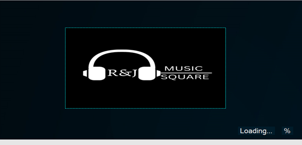
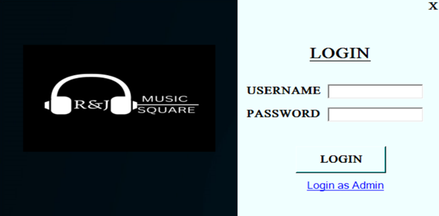
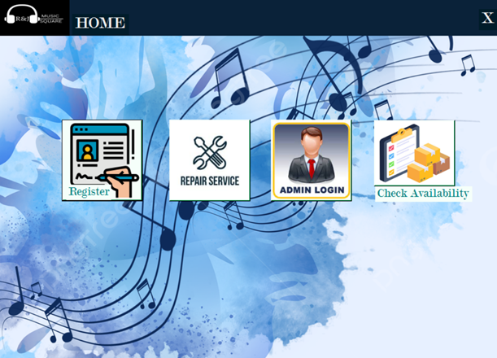
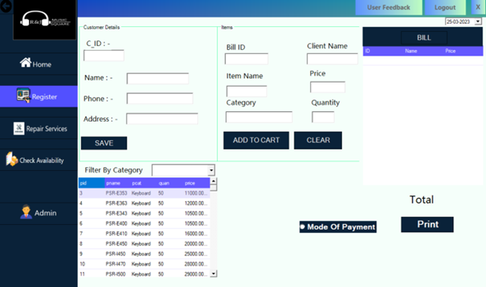
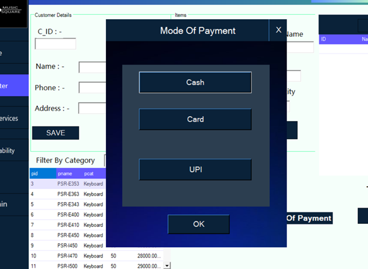
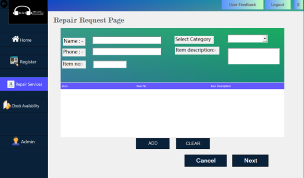
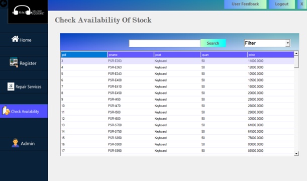
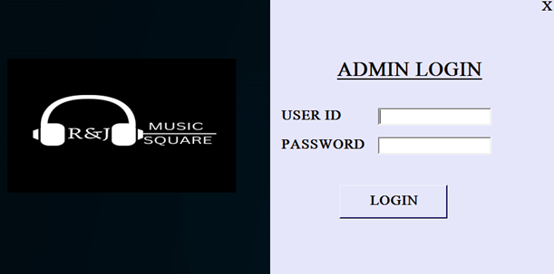
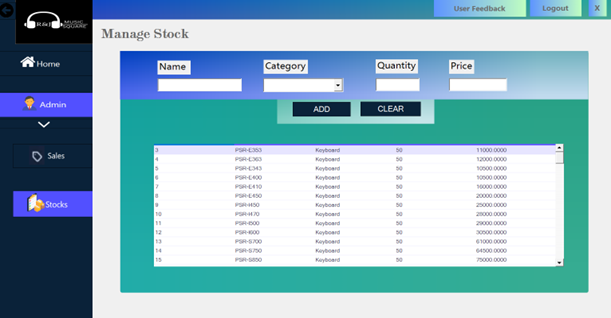

      
 

# **Introduction**

A Standalone desktop application that aims to help assist in organising the stocks, purchases and billing of instruments in a music store. This application is built using Visual Basic .NET as frontend and Microsoft SQL Server for the backend database.

# **Main Modules**

    - Login Page
    - Home Page
    - Admin Page
    - Register Page
    - Repair Page

# **UI Design**

# **Note**

* This project is *not* suitable for `commercial/real world` use, it is only for `Educational and Learning purposes` and can be used as `reference material` for School or College projects.

* Feel free to contribute to this project

* Raise an issue for queries, or when you face any issue.

* The databases schemas are present in the Databases folder. [Click here to navigate to the folder](Databases).

                    Have Fun Coding 🙂✌️
